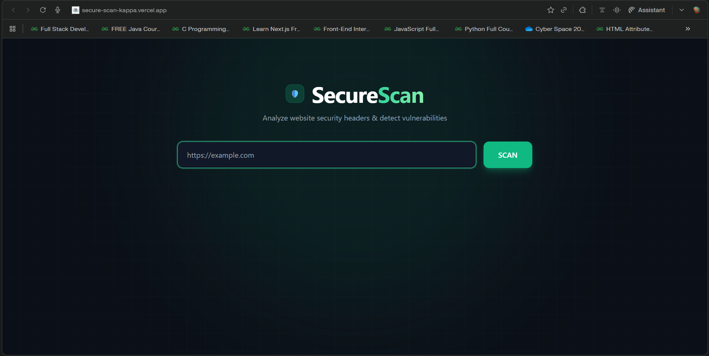
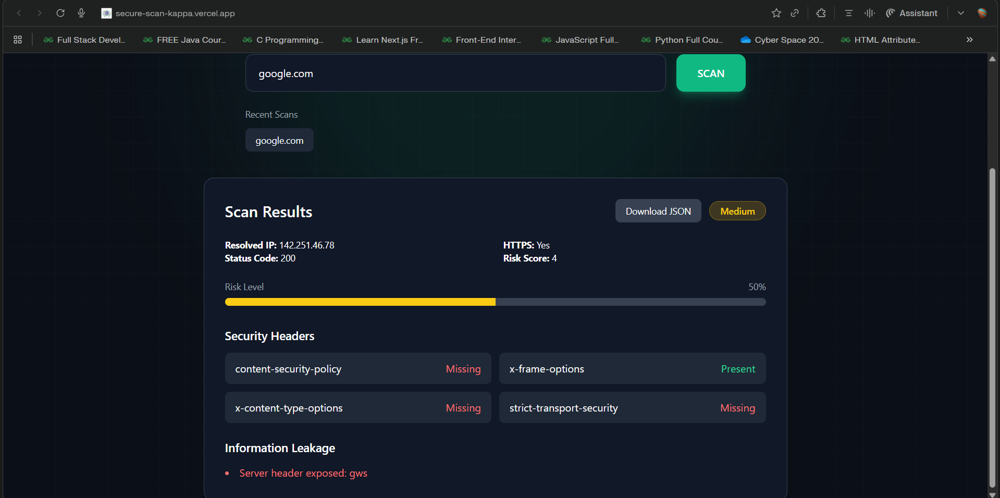

# SecureScan

SecureScan is a web vulnerability scanner that analyzes websites for security misconfigurations.

## Live Demo
https://secure-scan-kappa.vercel.app

## Features
- Security header analysis
- Risk scoring system
- Information leakage detection
- SSRF protection
- Scan history
- Downloadable scan report

## Tech Stack
Frontend: React + Tailwind + Framer Motion  
Backend: Node.js + Express + Axios  
Deployment: Vercel + Render

## Screenshots

### Home Page

### Scan Results

## Screenshots

  

  

